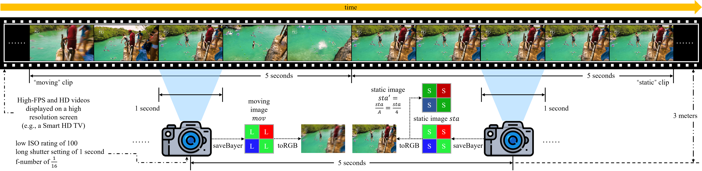

# QRNet

<br>Official PyTorch Implementation of the IEEE TIP 2024 Paper<br>

[Project](https://github.com/zhaoyuzhi/D2HNet) | [arXiv](https://arxiv.org/abs/2207.03294)

## 1 Introduction

QRNet is a state-of-the-art neural network that transforms the Quad-Bayer pattern into sharp and clean RGB images. This repo contains training and evaluation code for the following paper:

> [**Modeling Dual-Exposure Quad-Bayer Patterns for Joint Denoising and Deblurring**](https://github.com/zhaoyuzhi/D2HNet)<br>
> Yuzhi Zhao<sup>1</sup>, Lai-Man Po<sup>1</sup>, Xin Ye<sup>2</sup>, Yongzhe Xu<sup>2</sup>, Qiong Yan<sup>2</sup><br>
> <sup>1</sup>City University of Hong Kong, <sup>2</sup>SenseTime Research and Tetras.AI<br>
> *IEEE Transactions on Image Processing (**IEEE TIP**) 2024*<br>

Three examples to show the basic idea are illustrated below:


## 2 Dependency

This code is based on PyTorch 1.1 and CUDA 9.0. It has been tested on Ubuntu 18.04 LTS, where the machine is equipped with NVIDIA Titan GPUs.

The training is done on 4 NVIDIA Titan Xp GPUs, where 4 batches run on each GPU card. The training can be also performed on a single GPU card.

## 3 QR Dataset

### 3.1 Download links

Users can find the full D2-Dataset through the link below. Just unzip all `zip` files after downloading. Note that the full dataset is quite large (about 43.5Gb).

link：https://pan.baidu.com/s/1FunrgUvjdOyhz0hgBuW3JQ?pwd=3n6m 
code：3n6m

| Name | Description | Resolution | Numbers | Size |
| ---- | ---- | :----: | :----: | :----: |
| train | synthetic `training` tuples | 3016x2008 | 701 | 34.7GB |
| val | synthetic `val` tuples | 3016x2008 | 30 | 1.59GB |
| val_noisy_input | synthetic `val_noisy_input` tuples | 3016x2008 | 30 | 7.14GB |
| test | real captured `test` photos by IMX586 module | 4608x3456 | 4 | 121MB |

Please unzip it in this path. Then, rename the full path to `data`.

### 3.2 Explanation

The naming method of QR Dataset data can be found in Section 3.3 and can be summarized as:

| Symbol in Section 3.3 | Name (keyword) of image files | Description |
| :----: | :----: | :----: |
| *x<sub>s<sub>* | *_quadbayer_short.png | sub-sampled short-exposure Quad-Bayer |
| *x<sub>l<sub>* | *_quadbayer_long.png | sub-sampled long-exposure Quad-Bayer  |
| *x* | *_quadbayer_ls.png | synthetic dual-exposure Quad-Bayer |
| *y<sub>s<sub>* | *_rgb_short.png | sub-sampled RGB corresponding to 4*x<sub>s<sub>* |
| *y<sub>l<sub>* | *_rgb_long.png | sub-sampled RGB corresponding to *x<sub>l<sub>* |
| *y* | *_rgb_gt.png | sharpened RGB ground truth |
| *salmap* | *_sal_map.png | saliency map of *y* |
| *varmap* | *_var_map.png | variance map of *y* |

### 3.3 Data Synthesis

The data synthesis and capturing process is shown below:




### 3.4 Validation Data Synthesis (+noise)

To build validation tuples, we add physical noises to different types of input data as below (the brightness of input Quad-Bayer is enhanced for visualization):


## 4 Train

### 4.1 Run

The training can be done by simply runing:

```bash
python train.py --yaml_path options/qrnet_raw1_data4000_loss4.yaml
```

### 4.2 QRNet pre-trained models

Users can download pre-trained models via the link below:

link：https://pan.baidu.com/s/1bLyM1aKbFBVvYwmEJyBv2w?pwd=t7wq 
code：t7wq

Please unzip it in this path, you will get a folder named `snapshot`.

## 5 Validation and Testing

### 5.1 Validation

For validation on QR dataset, please run:

```bash
python validation.py --yaml_path options/qrnet_raw1_data4000_loss4.yaml
```

### 5.2 Testing (on Real-world Photos)

Noisy long- and short-exposure real-world pairs are provided. Please change `--src_path` to the data path (`Xiaomi_Mi_Note_10_photos`). Users can test the provided models using the following script:

```bash
python realworld.py
```

Resulting images will be automatically saved in the `results_real_photo`.

## 7 Citation

If you find this work useful for your research, please cite:

```bash
@article{zhao2024modeling,
  title={Modeling Dual-Exposure Quad-Bayer Patterns for Joint Denoising and Deblurring},
  author={Zhao, Yuzhi and Po, Lai-Man and Ye, Xin and Xu, Yongzhe and Yan, Qiong},
  journal={IEEE Transactions on Image Processing},
  year={2024}
}
```

## 8 Acknowledgement

We thank the SenseTime Research and Tetras.AI for helping capture the real-world photos and the hardware support.

Please contact yzzhao2-c@my.cityu.edu.hk for further questions.
